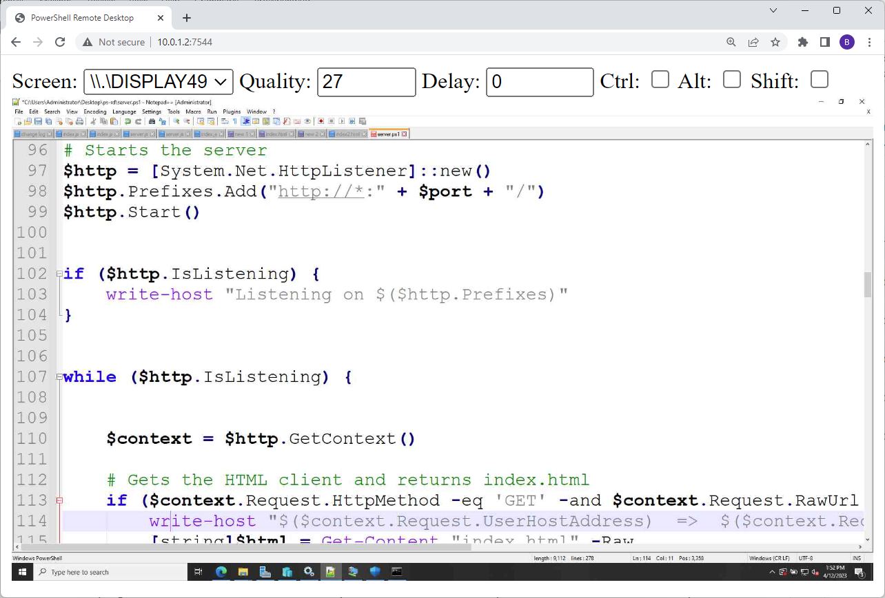

PowerShell Remote Desktop
---

This little project started as a whim: can I write a remote desktop server in nothing but PowerShell? The answer is yes, I can, and I did. It has little or no practical value because RDP and VNC already exist and are probably 10x times better than this pile of poo. It was something fun. I am creating a repo for this in case anyone else is interested in the results. This implementation runs an HTTP server and uses a browser as a client.



The usage of this is pretty straightforward. Just open up PowerShell and run it. It takes one parameter: -port, which tells it what port to start the server on.

```
.\server -port 7543
```

Then, port your browser to: *http://[host or ip]:port*

This will start serving the page and streaming the results.

You can increase the poll frequency by lowering the delay. You can decrease the bandwidth by lowering quality, but the picture will have compression artifacts.
